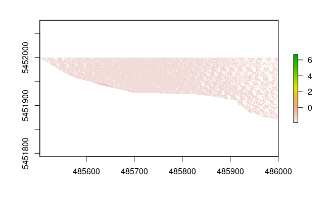

```{r setup, include=FALSE}
knitr::opts_chunk$set(echo = TRUE)
```

Exposure to residential greenness or green spaces such as parks or gardens are beneficial for multiple measures of health [@markevych2017; @labib2020]. Greenness and greenspace will be used as synonyms henceforth. Greenspace exposure can be categorized into three types: (a) availability, referring to the physical amount of greenspace, (b) accessibility, meaning the spatial proximity to greenspace, and (c) visibility, referring to the visual perception of greenness [@labib2020].

In [our](https://www.geography.nat.fau.eu/research/cultural-geography/wg-digital-health/#collapse_5) recent publication (in submission) we measured greenness taking a top-down, bird's eye view approach using remote sensing derived [NDVI](https://eos.com/ndvi/), to approximate the availability of greenness. Furthermore, we used a distance weighted road network to calculate potential neighborhood exposure models around participants place of residency, therefore also accounting for accessibility.

The next step will be, to combine greenness visibility with our potential neighborhood exposure models.

In this post, I will therefore demonstrate how to download and prepare all necessary files and methods needed for a visibility analysis. In the first part I demonstrate data acquisition and processing, in the second part I will explain the main functions used for the visibility analysis. My implementation of these methods is very light weighted and fast, while still maintaining high resolution.

## Libraries

First load all packages. If one of these packages has not been installed, use the `install.packages()` function.

[terra](https://CRAN.R-project.org/package=terra) is a relatively new R package that replaces the well known [raster](https://CRAN.R-project.org/package=raster). I have found `terra` to work much faster for most tasks.

```{r message=FALSE, warning=FALSE}
library(dplyr)
library(sf)
library(ggplot2)
library(ggthemes)
library(terra)
library(lidR)
library(future)
library(data.table)
```

## Data

The data is being stored in a different directory than this R project. Therefore I first need to assign my working directory.

```{r}
workdir <- "/media/sebastian/Red/Vancouver"
```

### DTM

First, we need to download the digital terrain model (DTM) generated from LiDAR data collected in 2013 for the City of Vancouver from the [City of Vancouver Open Data Portal](https://opendata.vancouver.ca/pages/home/).

```{r, eval=FALSE}
# Download DTM as .zip
download.file("https://webtransfer.vancouver.ca/opendata/TIF/DEM_2013_TIF.zip",
              destfile = file.path(workdir, "dtm.zip"))

# Unzip
unzip(zipfile = file.path(workdir, "dtm.zip"), exdir = "Data") 

# Delete .zip 
unlink(file.path(workdir, "dtm.zip"), recursive = TRUE)
```

```{r message=FALSE, warning=FALSE}
DTM <- terra::rast(file.path(workdir, "DEM/DEM_2013.tif"))

plot(DTM)
```

### LiDAR

Next, we will load the shapefile for the LiDAR 2013 tiles.

```{r}
# Lidar tiles
lidar_tiles <- read_sf("https://opendata.vancouver.ca/explore/dataset/lidar-2013/download/?format=geojson") %>% 
  st_transform(crs(DTM)) %>% 
  dplyr::select(name, lidar_url)

lidar_tiles %>% 
  ggplot() +
  geom_sf() + 
  theme_map()
```

Each tile of this shapefile contains the tile name and a link, to download the LiDAR data. The total file size of all 168 LiDAR scenes is \~90GB. We will safe them in a temporary file and calculate a DSM from the data later. I would highly recommend using parallel computation for this and to do something else while the data is being downloaded.

```{r eval=FALSE}
lidar_download <- function(x, tmp_dir) {
  # Download GeoTIFF as .zip
  download.file(x$lidar_url, destfile = paste0(file.path(tmp_dir, x$name), ".zip"))
  
  # Unzip
  unzip(zipfile = paste0(file.path(tmp_dir, x$name), ".zip"), 
        exdir = file.path(tmp_dir))
  
  # Delete .zip 
  unlink(paste0(file.path(tmp_dir, x$name), ".zip"), recursive = TRUE)
}

# Set number of  cores and path to tmp_dir
cores <- 22
tmp_dir <- file.path(workdir, "Temp")

if (!dir.exists(tmp_dir)) {
  dir.create(tmp_dir)
}

# Run function
if (cores > 1) {
  if (Sys.info()[["sysname"]] == "Windows") {
    cl <- parallel::makeCluster(cores)
    parallel::parApply(cl, lidar_tiles, 1, FUN = lidar_download, 
                                    tmp_dir = tmp_dir)
    parallel::stopCluster(cl)
  }
  else {
    split(lidar_tiles, seq(nrow(lidar_tiles))) %>% 
      parallel::mclapply(FUN = lidar_download, tmp_dir = tmp_dir, 
                         mc.cores = cores, mc.preschedule = TRUE)
  }
} else {
  apply(lidar_tiles, 1, FUN = lidar_download, 
         tmp_dir = tmp_dir)
}


```

One LiDAR tile has almost no land points and the algorithm can't process it.



Therefore, we need to remove it.

```{r eval=FALSE}
file.remove(file.path(tmp_dir, "CoV_4850E_54510N.las"))
```

Next, we can load all LiDAR files with the `lidR` package [@roussel2020] and calculate the DSM using the pit-free [@khosravipour2014] algorithm.

```{r eval=FALSE}
lidar_catalog <- lidR::readLAScatalog(tmp_dir)
crs(lidar_catalog) <- terra::crs(DTM)
opt_independent_files(lidar_catalog) <- TRUE

# Use future to calculate DSM
# Adjust number of cores with the workers parameter. This process is very RAM heavy!
plan(multisession, gc = TRUE, workers = 10)

# I would recommend to run this code from the console, to visualize the progress.
lidar_dsm <- grid_canopy(lidar_catalog, res = 0.5, 
                         pitfree(thresholds = c(0, 2, 5, 10, 15, 20), max_edge = c(0, 1.5)))

# Save raster and remove variables
lidar_dsm %>% 
  terra::rast() %>% 
  terra::writeRaster(filename = file.path(workdir, "DSM/dsm.tif"), format="GTIFF")
rm(lidar_catalog, lidar_dsm)

# Load DSM
dsm <- terra::rast(file.path(workdir, "DSM/dsm.tif"))
```

```{r include=FALSE}
dsm <- terra::rast(file.path(workdir, "DSM/dsm.tif"))
```

Let's take a look on the DSM. We will be using the [rayshader](https://CRAN.R-project.org/package=rayshader) package to generate a 2D map.

```{r}
dsm_clip <- rast(xmin = 487200, xmax = 487800, 
                 ymin = 5455800, ymax = 5456400,
                 crs = crs(dsm), res = 0.5)

# Crop DSM and convert to matrix
elev_matrix <- dsm %>% 
  crop(dsm_clip) %>% 
  matrix(
    as.vector(terra::values(.)),
    nrow = ncol(.), ncol = nrow(.)
  ) %>% 
  t()

library(rayshader)
options("cores" = 16)

# Calculate rayshader layers
ambmat <- ambient_shade(elev_matrix, multicore = TRUE)
raymat <- ray_shade(elev_matrix, lambert = TRUE, multicore = TRUE)


# Plot 2D
elev_matrix %>%
  sphere_shade(texture = "unicorn") %>%
  add_shadow(raymat, max_darken = 0.5) %>%
  add_shadow(ambmat, max_darken = 0.1) %>%
  plot_map()
```

There are some missing values in the raster and at the right edge of the map we can see a "wall". This is due to the fact, that power lines are being measured by LiDAR, too. Therefore we need to post-process the DSM to smooth the raster and fill empty pixels. We will apply a moving window approach. However, the DSM is too large, to apply `focal` on the whole raster at once. Therefore we will use the `lidar_tiles` shapefile from above, to apply smoothing and NA-value filling on subsets of the raster.

```{r eval=FALSE}
# Check if processing directory exists.
delete_folder <- FALSE
proc_dir <- file.path(workdir, "DSM/Proc")

if(!dir.exists(proc_dir)) {
  delete_folder <- TRUE
  dir.create(proc_dir)
}

pb = txtProgressBar(min = 0, max = nrow(lidar_tiles), initial = 0, style = 3)
for (i in 1:nrow(lidar_tiles)) {
  terra::crop(dsm, lidar_tiles[i,]) %>% 
    terra::focal(3, fun = median, na.only = T) %>% # fill NA values
    terra::focal(9, fun = median, na.rm = TRUE) %>% # smoothing
    terra::writeRaster(filename = file.path(proc_dir, 
                                            paste0("dsm_tile_", i, ".tif")),
                       format="GTIFF")
  
  setTxtProgressBar(pb, i)
}

# Merge raster tiles
filled_dsm <- dir(proc_dir, pattern = "dsm_tile_", full.names = T) %>% 
    lapply(rast) %>% 
    do.call(terra::merge, .)

# Delete temp files
if (delete_folder) {
  unlink(proc_dir, recursive = TRUE)
} else {
 unlink(dir(proc_dir, pattern = "dsm_tile_", full.names = T)) 
}

terra::writeRaster(filled_dsm, format="GTIFF",
                   filename = file.path(workdir, "DSM/dsm_filled.tif"))
```

```{r include=FALSE}
filled_dsm <- terra::rast(file.path(workdir, "DSM/dsm_filled.tif"))
```

Now let's look at the post-processed raster.

```{r}
# Crop DSM and convert to matrix
elev_matrix <- filled_dsm %>% 
  crop(dsm_clip) %>% 
  matrix(
    as.vector(terra::values(.)),
    nrow = ncol(.), ncol = nrow(.)
  ) %>% 
  t()

# Calculate rayshader layers
ambmat <- ambient_shade(elev_matrix, multicore = TRUE)
raymat <- ray_shade(elev_matrix, lambert = TRUE, multicore = TRUE)


# Plot 2D
elev_matrix %>%
  sphere_shade(texture = "unicorn") %>%
  add_shadow(raymat, max_darken = 0.5) %>%
  add_shadow(ambmat, max_darken = 0.1) %>%
  plot_map()
```

The DSM is a lot smoother than before. I have tested multiple different parameters for the smoothing-step and w=9 returned the best looking results. In the future I may apply the smoothing-step only on raster cells covered by power lines.

## Visibility Analysis

Greenspace is associated with several health benefits along multiple pathways [@markevych2017; @dzhambov2020; @labib2020]. In a recent study (in submission), we analyze health benefits based on the availability and accessibility of greenspace, using a top-down, bird's eye view, approach. Visibility describes a third type of exposure assessment and refers to the amount of greenspace that can be seen from a given point [@labib2020]. Recent studies have adopted viewshed-based visibility analysis [@chamberlain2013; @tabrizian2020; @labib2021], however there still is a limited use of visibility exposure assessment in current studies [@labib2020]. The following code is primarily based on the methods described by @labib2021 and their Python code of the [Green Visibility Index](https://github.com/jonnyhuck/green-visibility-index/blob/master/gvi.py), and the overall process is illustrated in the figure below.

[{width="7.13in"}](https://doi.org/10.1016/j.scitotenv.2020.143050)

~*Conceptual design of greenspace visibility modelling [@labib2021].*~

The line of sight is being calculated from the observer to every point in the area of interest, to distinguish between visible and invisible points. To determine green and no-green points, a greenspace mask will me intersected.

### Rasterprofile

To calculate the visibility of a point B from point A, we first need to access all raster cells from point A to B. The `rasterprofile` function returns a `matrix` with all cells from A to B, containing X- and Y-coordinates, the height and the cell-number for every cell. Surprisingly the `raster::extract` is faster than `terra::extract`.

```{r}
rasterprofile <- function(r, x0, y0, x1, y1, reso){
  # Sample a raster along a straight line between two points
  # Try to match the sampling size to the raster resolution
  dx = sqrt((x0 - x1)^2 + (y0 - y1)^2)
  nsteps = 1 + round(dx / reso)
  pointsZ <- cbind(x0 + (0:nsteps) * (x1 - x0) / nsteps, 
                   y0 + (0:nsteps) * (y1 - y0) / nsteps)
  
  rasterVals <- raster::extract(x = r, y = pointsZ, cellnumber = TRUE)
  
  pointsZ <- cbind(pointsZ, rasterVals[,2], rasterVals[,1])
  
  if (anyNA(pointsZ)) {
    pointsZ <- pointsZ[stats::complete.cases(pointsZ),,drop = FALSE]
  }
  return(pointsZ)
}
```

### Line of Sight

The observer at point A can only see point B, if no object in between point A and B blocks the view to point B. The `lineOfSight` function evaluates visibility along all cells from A to B, by calculating tangent *⍺* from *𝚫height* (opposite side) and *distance traveled* (adjacent side) and comparing it for every step. To see a point, its tangent *⍺* must be greater than the biggest tangent *⍺* so far. The function returns a `data.table` containing the cell number and corresponding visibility of all points from A to B. Visible cells have a value of 1 and non visible cells -1.

```{r}
lineOfSight <- function(xy1, x0, y0, 
                        height0, resolution, dsm_data) {
  # Get start XY from input
  x1 <- xy1[1]
  y1 <- xy1[2]
  
  # Get the pixels in the line
  pixels <- rasterprofile(r = dsm_data, x0 = x0, y0 = y0, x1 = x1, y1 = y1, 
                          reso = resolution)
  
  # Distance traveled so far
  distance_traveled = sqrt((y0 - pixels[,2])^2 + (x0 - pixels[,1])^2)
    
  # Calculate tangent from delta height (opposite side) and distance traveled (adjacent side)
  pixels <- cbind(pixels, (pixels[,3] - height0) / (distance_traveled * resolution))
  
  # Is visible? Current tangent must be greater than max. tangent
  is_visible <- function(x) {
    if (x[5] > max_tangent) {
        max_tangent <<- x[5]
        x[4]
    }
  }
  max_tangent <- -Inf
  visible_pixels <- apply(pixels, 1, is_visible) %>% 
    unlist() %>% 
    c(pixels[1,4], .) # the starting point is always visible
  
  # Assign 1 for visible and -1 for no-visible cells
  pixels[pixels[,4] %in% visible_pixels, 5] <- 1
  pixels[pixels[,5] != 1, 5] <- -1
  
  # Return cellnumber and visibility-value
  data.table::as.data.table(pixels[, 4:5])
}
```

### Viewshed

Finally, the visibility of all points withing a certain buffer around point A can be calculated, using the `lineOfSight` function. The `viewshed` function returns a circular raster (start point + max_distance-buffer) where values of 1 indicate visible points and -1 non-visible points. I am always calculating the line of sight to the points with the greatest distance from A and store the information about all points in-between. This way I can minimize the amount of time, that the `lineOfSight` needs to be called and significantly reduce computation time.

```{r}
viewshed <- function(sf_start, max_distance, dsm_data, dtm_data, resolution, 
                     observer_height, cores = 1, chunk_size = 150,
                     plot = FALSE, progressBar = TRUE) {
  
  # AOI
  this_aoi <- sf_start %>% 
    sf::st_buffer(max_distance)
  
  # Coordinates of start point
  x0 <- sf::st_coordinates(sf_start)[1]
  y0 <- sf::st_coordinates(sf_start)[2]
  
  # Observer height
  height0 <- as.numeric(terra::extract(dtm_data, cbind(x0, y0))) + observer_height
  
  # If the resolution parameter differs from the input-DSM resolution,
  # resample the DSM to the lower resolution.
  # Also, convert dsm_data_masked to "Raster" object, for faster internal calculation.
  if ((res(dsm_data)[1] != resolution) & (resolution >= 1)) {
    dsm_data_masked <- terra::crop(dsm_data, this_aoi) %>% 
      terra::aggregate(fact = resolution/terra::res(.)) %>% 
      terra::mask(terra::vect(this_aoi))
    
    output <- terra::setValues(dsm_data_masked, 0) %>%
      terra::mask(terra::vect(this_aoi))
    
    dsm_data_masked <- as(dsm_data_masked, "Raster")
  } else {
    dsm_data_masked <- terra::crop(dsm_data, this_aoi) %>% 
      terra::mask(terra::vect(this_aoi))
    
    output <- terra::setValues(dsm_data_masked, 0) %>% 
      terra::mask(terra::vect(this_aoi))
    
    dsm_data_masked <- as(dsm_data_masked, "Raster")
  }
  
  repeating = TRUE
  if (progressBar) {
    pb = txtProgressBar(min = 0, max = raster::values(output) %>% na.omit() %>% length(), 
                      initial = 0, style = 3)
  }
  
  while (repeating) {
    #if (plot) {
    #  plot(output, legend = F)
    #  points(x0, y0, col = "blue", pch = 20, cex = 1.8)
    #}
    # Select all cells of the output raster, that have not yet been analyzed.
    xy_stop <- terra::xyFromCell(output, which(terra::values(output) == 0)) %>% 
      # Calculate distance to start point
      cbind(., sqrt((y0 - .[,2])^2 + (x0 - .[,1])^2)) %>% 
      # Sort by distance
      .[order(-.[,3]), 1:2] %>% 
      .[1:ifelse(nrow(.) < chunk_size, nrow(.), chunk_size), ] %>%
      na.omit() %>% 
      # Convert to list for lapply
      split(seq(nrow(.)))
    
    # Apply lineOfSight function on every point in xy_stop
    if (cores > 1) {
      if (Sys.info()[["sysname"]] == "Windows") {
        cl <- parallel::makeCluster(cores)
        parallel::clusterExport(cl, "rasterprofile")
        parallel::clusterEvalQ(cl, library("dplyr"))
        this_LoS <- parallel::parLapply(cl, xy_stop, fun = lineOfSight, 
                                       x0 = x0, y0 = y0,
                                       height0 = height0, resolution = resolution, 
                                       dsm_data = dsm_data_masked)
        parallel::stopCluster(cl)
      }
      else {
        this_LoS <- parallel::mclapply(xy_stop, lineOfSight, 
                                       x0 = x0, y0 = y0,
                                       height0 = height0, resolution = resolution, 
                                       dsm_data = dsm_data_masked, 
                                       mc.cores = cores, mc.preschedule = TRUE)
      }
    } else {
      this_LoS <- lapply(xy_stop, FUN = lineOfSight, 
                         x0 = x0, y0 = y0,
                         height0 = height0, resolution = resolution, 
                         dsm_data = dsm_data_masked)
    }
    
    # Bind list
    this_LoS <- this_LoS %>% 
      data.table::rbindlist()
    
    # Copy result of lapply to the output raster 
    output[this_LoS[[1]]] <- this_LoS[[2]]
    
    if (progressBar) {
      setTxtProgressBar(pb, length(which(terra::values(output) %in% c(-1,1))))
    }
    
    # Exit if all points in the output raster have been analyzed 
    if (!any(terra::values(output) == 0, na.rm = T)) {
      repeating <- FALSE
    }
  }
  
  # Compare DSM with Visibilty
  if (plot) {
    par(mfrow=c(1,2))
    plot(dsm_data_masked); points(x0, y0, col = "red", pch = 20, cex = 2)
    plot(output, legend = F); points(x0, y0, col = "red", pch = 20, cex = 2)
    par(mfrow=c(1,1))
  }
  return(output)
}
```

The animation below illustrates, the functionality of the `viewshed` function. Starting with a raster of unknown visibility (yellow), we iterative call the `lineOfSight` function and set the status of each raster cell to visible (green) or no-visible (white).

```{r fig.height=5, fig.width=5, echo=FALSE}
 knitr::include_graphics("LoS.gif")
```

### Examples

As already mentioned, we first need to convert the DSM and DTM to a raster. We also need to create a start point for our example.

```{r}
# Disable progress bar for terra::aggregate
terraOptions(progress = 0)

sf_start <- sfheaders::sf_point(c(487616.2, 5455970)) %>% 
    st_sf(crs = st_crs(26910))
```

#### 1. Resolution = 0.5m

Output-Raster-Cells: 1 440 000\
Runtime: 3.3 seconds (cores=1: \~7 seconds)\
Total visibility: 11.9%

```{r fig.height=9, fig.width=16}
viewshed_1 <- viewshed(sf_start = sf_start, max_distance = 300,
                       dsm_data = filled_dsm, dtm_data = DTM, 
                       resolution = 0.5, observer_height = 1.8, 
                       cores = 10, chunk_size = 2000,
                       plot = TRUE, progressBar = FALSE)
```

#### 2. Resolution = 1m

Output-Raster-Cells: 360 000\
Runtime: 1.2 seconds (cores=1: \~2 seconds)\
Total visibility: 12.4%

```{r fig.height=9, fig.width=16}
viewshed_2 <- viewshed(sf_start = sf_start, max_distance = 300,
                       dsm_data = filled_dsm, dtm_data = DTM, 
                       resolution = 1, observer_height = 1.8, 
                       cores = 10, chunk_size = 2000,
                       plot = TRUE, progressBar = FALSE)
```

#### 3. Resolution = 2m

Output-Raster-Cells: 90 000\
Runtime: 0.5 seconds (cores=1: \~0.8 seconds)\
Total visibility: 12.8%

```{r fig.height=9, fig.width=16}
viewshed_3 <- viewshed(sf_start = sf_start, max_distance = 300,
                       dsm_data = filled_dsm, dtm_data = DTM, 
                       resolution = 2, observer_height = 1.8, 
                       cores = 10, chunk_size = 2000,
                       plot = TRUE, progressBar = FALSE)
```

#### 4. Resolution = 5m

Output-Raster-Cells: 14 400\
Runtime: \~0.35 seconds (cores=1: \~0.25 seconds)\
Total visibility: 14.6%

```{r fig.height=9, fig.width=16}
viewshed_4 <- viewshed(sf_start = sf_start, max_distance = 300,
                       dsm_data = filled_dsm, dtm_data = DTM, 
                       resolution = 5, observer_height = 1.8, 
                       cores = 5, chunk_size = 500,
                       plot = TRUE, progressBar = FALSE)
```

## Network Visible Greenspace

### Greenspace Mask

After calculating visibility, we can now determine level of greenness for the visible cells. We will be using the [Vancouver Land Cover Classification 2014 - 2m LiDAR (Raster)](http://www.metrovancouver.org/data/Data/LandCoverClassification-2m/LCC2014_2m_LiDAR_gdb.zip). This data can be opened using ArcGIS and exported as TIFF for further analysis. From the documentation we can read the class values as follows:

```{r echo=FALSE, message=FALSE, warning=FALSE}
library(kableExtra)
dplyr::tibble(
    Value = 1:14,
    "Level 1" = c(
      "Built-up", "", "", "Bare", "", "Vegetation", 
      "", "", "", "", "", "Water", "Shadow", "Clouds/Ice"
    ),
    "Level 2"  = c(
      "Buildings", "Paved", "Other Built", "Barren", "Soil", "Tree canopy", 
      "", "", "Grass-herb", "", "Non-photosynthetic vegetation", "", "", ""
    ),
    "Level 3" = c(
      "", "", "", "", "", 
      "Coniferous", "Deciduous", "Shrub", 
      "Modified Grass-herb", "Natural Grass-herb", "", "", "", ""
    ),
    "Criteria" = c(
      "Identified using shape/size, shadow cast, height, relative canopy height, texture.",
      "Everything from sidewalks and alleys to highways.",
      "Not concrete/asphalt built surfaces or building roofs. Sports surfaces (artificial turf and running tacks), possibly transit or rail areas, other impervious surfaces, etc.",
      "Beaches, alpine rock, shoreline rock, etc. Lack of vegetation. Likely not soil (colour/context suggests no organic matter and/or imperviousness). Also quarries, gravel pits, dirt roads.",
      "Agricultural soils (could be light or dark), cleared/open areas where darker colours indicate organic matter present (as compared to, e.g. sand), potentially riverine/alluvial deposits.",
      "Predominantly coniferous (>75%)",
      "Predominantly deciduous (>75%)",
      "Woody, leafy, and generally rough-textured vegetation shorter than trees (approx. <3-4m), taller than grass.",
      "Crops, golf course greens, city park grass, lawns, etc.",
      "Alpine meadows, near-shore grass areas, bog/wetland areas.",
      "Dead grass, drought stressed vegetation, could include log",
      "Lakes, rivers, inlets, irrigation channels, retention ponds, pools, etc.",
      "Dark pixels with v/ low reflectance values. Image features not easily visible. Compare w/ RapidEye image for shadow",
      "Very bright pixels, that are not high-reflectance features from built-up areas."
    )
) %>% kbl(escape = FALSE, align=c("l", "c", "c", "c", "l"),
          table.attr = "style='width:90%;'") %>% 
  kable_classic("striped", full_width = F) %>%
  row_spec(0, bold = T)
```

For demonstration purpose I will use all vegetation classes as one criteria (green vs. no-green).

```{r fig.height=9, fig.width=16}
# Load LandCover
landCover <- rast(file.path(workdir, "LCC2014_2m_LiDAR1.tif"))

# Select Vegetation
greenspace <- landCover %in% c(6:10); invisible(gc())

# Plot to compare LandCover and vegetation mask
par(mfrow = c(1,2))
landCover %>% 
  crop(dsm_clip) %>% 
  plot(legend = FALSE)

points(st_coordinates(sf_start)[1], st_coordinates(sf_start)[2], 
       col = "blue", cex = 3, pch = 20)

greenspace %>% 
  crop(dsm_clip) %>% 
  plot(legend = FALSE)

points(st_coordinates(sf_start)[1], st_coordinates(sf_start)[2], 
       col = "blue", cex = 3, pch = 20)
```

The `visibleGreen` function returns the proportion of visible greenspace to total visibility. The values range between 0 and 1, where 0 = no green cells are visible, and 1 = all of the visible cells are green. Applying the `visibleGreen` function on the `viewshed_1` object calculated above returns 0.91, meaning that 91% of the visible area is vegetated. 

```{r}
visibleGreen <- function(viewshed, greenspace) {
  # Get XY coordinates that are visible
  xy <- viewshed %>% 
    raster::xyFromCell(which(viewshed[] == 1))

  # Intersect XY with greenspace mask
  output <- greenspace[raster::cellFromXY(greenspace, xy)] %>% 
    unlist(use.names = FALSE)

  # Proportion of visible green
  return(sum(output == 1) / length(output))
}
```

### Network Analysis

We will use the `DRIGLUCoSE` R package from our recent publication to calculate a road network, and finally asses visible greenspace along the network. For a detailed explanation of the `DRIGLUCoSE` package see the [GitHub repository](https://github.com/STBrinkmann/DRIGLUCoSE).

```{r message=FALSE, warning=FALSE}
# Download and process road network from OSM data
aoi.osm <- DRIGLUCoSE::osm_roads(x = sf_start, dist = 10, speed = 75)

# Calculate isodistances
aoi.isodistances <- DRIGLUCoSE::isodistances(x = sf_start %>% mutate(tag = 1),
                                             tag = "tag", road_network = aoi.osm, 
                                             speed = 75, 
                                             isochrones_seq = seq(1, 10, 1))
```

In the figure below the isodistances are being illustrated. The red point represents the starting point. We will calculate visible greenspace proportion every 25m, at the green points.

```{r echo=FALSE, fig.height=7, fig.width=10, message=FALSE, warning=FALSE, dev='svg'}
aoi.isodistances %>%
  mutate(time = as.integer(time)) %>% 
  tmap::tm_shape() +
  tmap::tm_lines(col = "time", lwd = 3, #style = "cont",
                 palette = "-viridis", n = 10,
                 title.col = "Walking-Distance\n(minutes)",
                 legend.col.is.portrait = T) +
  tmap::tm_shape(sf_start) + 
  tmap::tm_dots(col = "red", size = 0.9, shape = 20) +
  tmap::tm_shape(aoi.isodistances %>% 
                   sf::st_union() %>% 
                   sf::st_cast("LINESTRING") %>% 
                   sf::st_line_sample(density = 1/25) %>% 
                   sf::st_cast("POINT")) +
  tmap::tm_dots(col = "darkgreen", size = 0.28, shape = 20, alpha = 0.5) +
  tmap::tm_layout(legend.outside.position = "right",
                  legend.position = c(-0.248, 0.6),
                  legend.outside.size = .15,
                  legend.title.size = 1.5,
                  legend.text.size = 1,
                  panel.show = F)
```

To evaluate network visibility, we will write a new function `networkVisibleGreenspace` to apply all previous steps for a point along the network.

```{r}
networkVisibleGreenspace <- function(x, isodistance, greenspace,
                                     dsm_data, dtm_data, 
                                     resolution, max_distance, observer_height, 
                                     cores, chunk_size, plot = FALSE) {
  
  # 1. Calculate viewshed
  this_viewshed <- viewshed(sf_start = x, max_distance = max_distance,
                            dsm_data = dsm_data, dtm_data = dtm_data, 
                            resolution = resolution, 
                            observer_height = observer_height, 
                            cores = cores, chunk_size = chunk_size, 
                            plot = plot, progressBar = FALSE)
  
  # 2. Proportion of visible greenspace of total visibility
  this_visibleGreen <- visibleGreen(viewshed = this_viewshed, 
                                    greenspace = greenspace)
  
  # 3. Get time value of x from isodistance
  return(dplyr::tibble(time = isodistance[sf::st_nearest_feature(x, isodistance),]$time, 
                       visibleGreen = this_visibleGreen,
                       X = as.numeric(st_coordinates(x)[1]),
                       Y = as.numeric(st_coordinates(x)[2])))
}
```

We can use the `st_line_sample` function to sample points along the isodistance object. Furthermore, in the viewshed examples above we have seen, that for `resolution = 2` the computation time hardly differs if we set `cores = 1`. Therefore I use `cores = 1` in the `networkVisibleGreenspace` and call it from the `mclapply` with parallel processing.
```{r eval=FALSE}
# Sample points on the isodistance for every 25m 
all_points <- aoi.isodistances %>% 
  st_union() %>% 
  st_cast("LINESTRING") %>% 
  st_line_sample(density = 1/25) %>% 
  st_cast("POINT") %>% 
  st_as_sf()

# Calculate network visibilty 
output <- all_points %>% 
  split(seq(nrow(.))) %>% 
  parallel::mclapply(networkVisibleGreenspace,
                     isodistance = aoi.isodistances, greenspace = greenspace,
                     dsm_data = filled_dsm, dtm_data = DTM, resolution = 2, 
                     max_distance = 300, observer_height = 1.8, cores = 1, 
                     chunk_size = 150, plot = FALSE, 
                     mc.cores = 22, mc.preschedule = TRUE) %>% 
  do.call(rbind, .)
```

```{r echo=FALSE, fig.height=7, fig.width=10, message=FALSE, warning=FALSE, dev='svg'}
output <- read.csv(file.path(workdir, "gvi_example.csv")) %>% 
  as_tibble() 

output %>% 
  sf::st_as_sf(coords = c("X", "Y"), crs = sf::st_crs(26910)) %>% 
  tmap::tm_shape() +
  tmap::tm_dots(col = "visibleGreen", shape = 20, size = 0.5,
                palette = "RdYlGn", n = 10,
                title = "Visible Greenspace") +
  tmap::tm_layout(legend.outside.position = "right",
                  legend.position = c(-0.25, 0.62),
                  legend.outside.size = .15,
                  legend.title.size = 1.35,
                  legend.text.size = 1,
                  panel.show = F,
                  frame = FALSE)
```

As the last step, we need to summarize all measurements from the previous steps. I simply take the mean of all values, but one could also apply a linear or logistic weights function, such that the influence of a variable decreases with increasing distance, as demonstrated in our recent publication.

```{r}
round(mean(output$visibleGreen), 2)
```

A mean value of 0.51 indicates, that 51% of the visible area along the network is vegetated. However, we can see a high diversity in the example above, in that the northern half has higher visible greenness. Therefore, future research may also incorporate actual activity space measurements instead of potential activity space, to further analyze where participants spend time and thus improve the understanding of greenspace related health effects.

## Conclusion

Data acquisition and processing with `lidR` and `terra` is simple and fast using R as the only tool. The implementation of a parallel viewshed algorithm has proven to be very light-weighted and fast. Using a lower resolution significantly reduces model runtime. However, even at highest resolution, the runtime is acceptable. The effect of multiprocessing is significant only with high resolution or very large values of `max_distance`. Using this algorithm in a large scale study at high resolution appears to be practical. Compared to model 1, model 4 has an increase in visible area from 11.9% to 14.6%. The results of the other models are closer to model 1. In my opinion the trade-off between loss of accuracy for an increase in speed still is acceptable. But reducing the resolution to 5m or even more might only be worth it for large values of max_distance, since the computation time hardly differs from 2m resolution. I would suggest comparing a few points with 0.5m, 1m, 2m and 5m resolution.

A simple implementation of the viewshed analysis into a route network analysis is one practical example, for researching greenspace exposure.

## References
