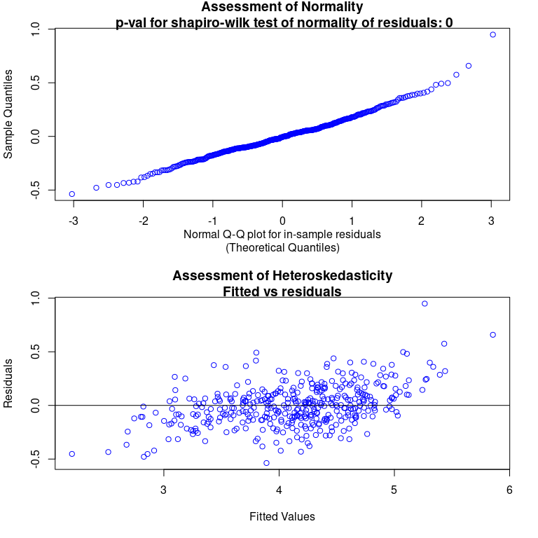

```{=html}
<style>
body {
text-align: justify}
</style>
```
In our [recent publication from 2020](https://geobrinkmann.com/publication/scarpone2020/) we analyzed COVID-19 incidence and socioeconomic, infrastructural, and built environment characteristics using a multimethod approach. There are 401 counties in Germany; as shown in the figure below, these vary in size, such that the counties in Southern Germany are generally smaller with higher population densities. Natural log-transformed age-adjusted incidence rates of COVID-19 as of April 1st are shown, indicating spatial variation between the northeast and south-southwest of the study area. {width="60%"}

After conducting a throughout spatial exploratory analysis, we used a Bayesian Additive Regression Trees (BART; @Chipman2010) model, to identify important socioeconomic and built environment covariates with COVID-19 incidence rate. BART is a ensemble-of-trees method, such as random forests [@breiman2001] and stochastic gradient boosting [@friedman2002].\
Tree-based regression models have an advantage, as they can flexibly fit interactions and non-linearities. A sum-of-trees model - such as BART or random forest - has an even greater ability than a single-tree model. However, BART differs from these two examples, as it uses a underlying Bayesian probability model rather than a pure algorithm [@kapelner2016]. One of the advantages of using a Bayesian approach is, that it computes Bayesian posterior distributions to approximate the nonparametric model parameters. The priors aim to prevent a single regression from dominating, thus reducing the risk of overfitting [@kapelner2016; @scarpone2020].

For our analysis we have used the R package `bartMachine` [@kapelner2016]. Unfortunately `bartMachine` does not support tibble objects as input features, but apart from that it's intuitive and simple to use.\
In this post I will use the data we have used in our COVID-19 paper, to analyze age-adjusted incidence rates of COVID-19 for German counties. Even though the BART model has great predictive power, we will not use it to predict new cases of COVID-19, but rather use it as a exploratory tool to understand, what factors contribute to the spreading of COVID-19 and how they interact with the incidence rate.

I want to make it clear, that I will use data of one specific date. We have chosen the 1st April 2020, to analyze only the first wave of COVID-19 in Germany. A friend of mine currently analyses what effects contributed to the second and third waves. Even though there are many factors, that kept being important, many features gained or lost importance and some even showed a inverted effect.

Therefore, BART is used as an exploratory tool and with the help of Partial Dependence Plots we will gain insight of the marginal effects of the important predictors of COVID-19.

I will not focus on pre-modelling exploratory data analysis, nor explain the data engineering here. But feel free to read the [paper](https://geobrinkmann.com/publication/scarpone2020/) or [contact me](https://geobrinkmann.com/#contact).

## Data download and pre-processing

First, we need to load the packages and set the memory size and number of cores that `bartMachine` should be using.

```{r message=FALSE, warning=FALSE}
# Set to use 45 GB memory - adjust this to your resources
options(java.parameters = "-Xmx45g")

# Load packages
library(bartMachine)
library(dplyr)

# Set to run on 20 threads - adjust this to your resources
set_bart_machine_num_cores(20)
```

I would suggest, that you double check if the correct amount of RAM has been made available, when loading `bartMachine`. If the message states a completely different amount of memory, try to manually write the java.parameters string, instead of copy&pasting.

Next, we need to download the data and normalize the church density (*Rch_den*) variable.

```{r}
# Function for linear stretching. New range: 0-1
range0_1 <- function(x){(x-min(x))/(max(x)-min(x))}

# Download data
data <- read.csv("https://github.com/CHEST-Lab/BART_Covid-19/raw/master/Data/GermanyTraining.csv",
                 stringsAsFactors = F) %>%
  mutate(Rch_den = range0_1(Rch_den),
         NUTS2_Fact = as.factor(NUTS2_Fact), 
         BL_ID = as.factor(BL),
         S_109 = as.factor(S_109))

# Select variables: Lat/ Long, BL, NUTS2, socioeconomic, build environment and age adjusted case rate
data <- data[c(374, 3, 4, 5, 38, 28, 65:372)]
```

```{r echo=FALSE, message=FALSE, warning=FALSE}
library(kableExtra)
data %>% as_tibble() %>% 
  head() %>% 
  kbl(escape = FALSE, table.attr = "style='width:90%;'", digits = 2) %>% 
  kable_classic("striped", full_width = F) %>%
  row_spec(0, bold = TRUE)
```

The first column (*AdjRate*) contains age-adjusted incidence rates. The X and Y coordinates (longitude and latitude) contain the spatial information. The NUTS2 code represents the government regions (Regierungsbezirke) ID, *BL_ID* contains the name of the federal state (Bundesland) and EWZ refers to the population count. After that follows a ton of socioeconomic, infrastructural, and built environment characteristics. We will thin out the important features later and talk about their meaning, so don't worry about the coding of the variables.

BART needs a data.frame of predictors and a vector of the response variable.

```{r}
psych::skew(data$AdjRate)

# Response variable
y <- log(data$AdjRate)

# Data.frame of predictors
data_bm <- select(data, -c(AdjRate))
```

AdjRate is highly skewed (skewness = 3.64) and was therefore log-transformed. The results from the BART machine won't differ with the highly skewed data, since it is non-parametric. However, to improve visual interpretability, we will use the log-rate in all the figures.\
Below I have printed the summary statistics of the AdjRate (log), to understand the model outputs.

```{r echo=FALSE, message=FALSE, warning=FALSE}
tibble(
  Mean = mean(y),
  SD = sd(y),
  Min = min(y),
  Max = max(y)) %>% 
  kbl(escape = FALSE, digits = 2) %>% 
  kable_classic("striped", full_width = FALSE) %>%
  row_spec(0, bold = TRUE)
```

## First BART model

It would be fine to use the default values for the hyperparameter (e.g. number of trees), however `bartMachine` comes with a simple function to compute optimal hyperparameters, called `bartMachineCV`. This will take quite some time to run! Therefore I have excluded this function from the script and just build a bartMachine with the optimal parameters.

```{r}
bm_All <- bartMachine(X = data_bm, y = y, 
                      k=2, nu=3, q=0.9, num_trees=100, 
                      num_iterations_after_burn_in=2000, 
                      num_burn_in = 300, 
                      seed = 1234, verbose = FALSE)

summary(bm_All)
```

The Pseudo-R² of `r round(bm_All$PseudoRsq, 2)` and RMSE of `r round(bm_All$rmse_train, 2)` look quiet promising, but let's check for error assumptions.

```{r eval=FALSE, fig.width=8, fig.height=8}
check_bart_error_assumptions(bm_All)
```



Both plots look good. In the second one (Assessment of Heteroskedasticity) we can detect a visible pattern - however not a prominent one! From both plots I would assume that the overall performance of the model is good, however it might struggle with extreme values.

```{r eval=FALSE, fig.width=8, fig.height=8}
plot_y_vs_yhat(bm_All, credible_intervals = TRUE)
```


The "Fitted vs. Actual Values" plot above indicates overall good model performance. Again, we can see that the model struggles with extreme values. Low values will be over-predicted and high values will be under-predicted. We could also map the residuals geographically and see, if there is spatial clustering. But first, we will reduce the model complexity by removing non-important variables.

## Variable Selection

BART is quiet a powerful machine learning tool, but there is more to it than amazing R² values! If you are dealing with a high dimensional data set (like our data with 313 predictors), often only a relatively small subset of predictor variables truly influences the response variable. Occam's razor describes this philosophy, that simpler models should be preferred to unnecessarily complex ones.\
The `var_selection_by_permute` function performs variable selection introduced by @bleich2014, to reduce model complexity. Let's run the next chunk and investigate the most important variables. You may skip this step and just use my results, as this will take quiet long to run...

```{r eval=FALSE}
# Leave the num_trees_for_permute small, to force variables to compete for entry into the model!
var_sel <- bartMachine::var_selection_by_permute_cv(bm_All, num_trees_for_permute = 20)

# Look at the most important variables
var_sel$important_vars_cv
```

```{r echo=FALSE}
c("BL_ID_Baden-Württemberg", "BL_ID_Bayern", "BL_ID_Hessen", "ff_pop", "hair_pp", "thea_pp", "NUTS2_Fact_11", "NUTS2_Fact_27", "NUTS2_Fact_40", "NUTS2_Fact_71", "S_170", "play_dn", "bir_km2", "cc_pop", "sch_den", "kid_den", "Rch_den", "S_109_2", "EWZ", "Pop_Den", "S_004", "S_006", "S_020", "S_051", "S_054", "S_066", "S_070", "S_080", "S_104", "S_107", "S_115", "S_123", "S_130", "S_146", "S_153", "X", "Y")
```

Below I have categorized the important variables, that will be used for the second BART model. Also I have removed the *NUTS2_Fact* and *BL_ID* variables.

```{r}
data_subset <- data_bm %>%
  select(c(
    # Geographical Units
    X, #Longitude
    Y, #Latitude
    
    # Political units
    S_109, #Rural/Urban
    
    # Socioeconomic
    EWZ, #Population
    Pop_Den, #Population density
    S_004, #Unemployment rate under 25
    S_006, #Household income per capita 
    S_020, #Employment rate 15-<30
    S_051, #Voter participation
    S_054, #Apprenticeship positions
    S_066, #Household income
    S_070, #Deptors rate
    S_080, #Recreationl Space
    S_104, #Income tax
    S_107, #Steuerkraft
    S_115, #Regional population potential
    S_123, #Child poverty
    S_130, #IC train station access
    S_146, #Commuters >150km
    S_153, #Foreign guests in tourist establishments
    S_170, #Longterm unemployment rate
    
    # Built environment
    Rch_den, #Church density
    play_dn, #Playground density
    bir_km2, #Biergarten per km²
    ff_pop, #Fast food places per capita
    hair_pp, #Hairdresser per capita
    thea_pp, #Theatre per capita
    cc_pop, #Community centre density
    sch_den, #School density
    kid_den #Kindergarten density
  ))
```

## Second BART model

With the subset of important predictors, we will build a second BART model. Again, I have already computed the optimal hyperparameters using the `bartMachineCV` function.

```{r}
bm_final <- bartMachine(X = data_subset, y = y, 
                        k=3, nu=3, q=0.99, num_trees=225,
                        seed = 1234, verbose = FALSE)
summary(bm_final)
```

Compared to the first BART model, the second one saw a reduction in Pseudo-R² from `r round(bm_All$PseudoRsq, 2)` to `r round(bm_final$PseudoRsq, 2)`, equating to a `r round((bm_All$PseudoRsq - bm_final$PseudoRsq) / bm_All$PseudoRsq * 100)`% reduction in explained variability. The RMSE increased from `r round(bm_All$rmse_train, 2)` to `r round(bm_final$rmse_train, 2)`, indicating that the final model predicted age-adjusted incidence rates of COVID-19 for German counties with an accuracy of +/− `r round(exp(bm_final$rmse_train), 1)` cases per 100,000. Again we need to check error assumptions and fitted vs. actual values.

```{r eval=FALSE, fig.width=8, fig.height=8}
check_bart_error_assumptions(bm_final)
```

 The new model is expected to perform worse compared to the first model, but the Q-Q and Fitted vs. Residuals plots both look good. Again, the BART model struggles with extreme (high) values.

```{r eval=FALSE, fig.width=8, fig.height=8}
plot_y_vs_yhat(bm_final, credible_intervals = TRUE)
```


The "Fitted vs. Actual Values" plot above indicates overall OK model performance. This time however, a larger amount of values are outside of the confidence interval. We will also map the residuals, to test for spatial clustering.

## Spatial autocorrelation

Spatial autocorrelation can be tested by mapping the residuals. I have provided a cleaned shapefile of the NUTS3 (federal states) regions in Germany. The mapped residuals allow us to visualize under- and overpredictions and check for spatial clustering of residuals. From this map I could not detect a discernible pattern of clustering - the residuals are randomly distributed.
```{r fig.height=7, fig.width=7, message=FALSE, warning=FALSE}
library(sf)
library(RColorBrewer)
library(tmap)

# Download shapefile
shp <- read_sf("https://github.com/STBrinkmann/data/raw/main/RKI_sf.gpkg")

# Sort shapefile, that it has the same order as the data_subset
shp <- shp[order(match(shp$EWZ, data_subset$EWZ)),]

# Join residuals to shapefile, then map residuals
shp$resid <- bm_final$residuals
tm_shape(shp) + 
  tm_polygons(col="resid", 
              title="BART Machine Residuals\n(log incidence rate)", 
              breaks=seq(-1.75, 1.75, 0.5), midpoint=NA, palette="RdBu") + 
  tm_layout(frame = FALSE,
            inner.margins=c(0.02, 0.02, 0.02, 0.20),
            legend.position = c(0.7, 0.22),
            legend.frame = TRUE,
            legend.outside = FALSE, 
            bg.color = "white")
```
To determine whether the spatial autocorrelation of residuals is statistically significant or not, one could compute Moran's I. I will not explain Moran's I in this post, but I would highly recommend these posts: [Intro to GIS and Spatial Analysis](https://mgimond.github.io/Spatial/spatial-autocorrelation-in-r.html#app8_3) and [Spatial autocorrelation analysis in R](https://rpubs.com/quarcs-lab/spatial-autocorrelation).

```{r message=FALSE, warning=FALSE}
library(spdep)
# Define neighboring polygons
nb <- poly2nb(shp, queen=TRUE)

# Assign weights to each neighboring polygon
lw <- nb2listw(nb, style="B", zero.policy=TRUE)

# Compute Moran's I statistic using a Monte-Carlo simulation 
MC <- moran.mc(shp$resid, lw, nsim=99)
MC
```
The Moran's I score is between -1 and 1, where high (low) values determine positive (negative) spatial autocorrelation and 0 identifies the data is randomly distributed. The Morans's I statistic of `r round(MC$statistic, 2)` (p=`r round(MC$p.value, 2)`) further confirms, that there is no spatial autocorrelation. 

## Partial Dependence Plots

In the previous steps we have build a robust BART machine to predict age-adjusted incidence rates of COVID-19 for German counties. However, as already mentioned in the beginning, I am interested in using BART as a exploratory tool. The high R² indicates, that the model did understand the non-linear relationships of the covariates with the COVID-19 incidence rate. To visualize and explore these relationships, Partial Dependence Plots (PDPs) are a great tool. PDPs are graphical outputs that illustrate the marginal effect of each independent variable on the response variable [@friedman2002; @scarpone2017; @scarpone2020].

The R package [pdp](https://cran.r-project.org/web/packages/pdp/index.html) provides great tools for computing partial dependence. However it does not support `bartMachine`. But that's no problem, as `bartMachine` also comes with a build in function to generate PDPs. The function in the `bartMachine` package is called `pd_plot`. I will demonstrate a PDP and it's corresponding histogram on the example of *S_115* (Regional Population Potential). The values of *S_115* are plotted on the x-axis and its marginal effect in incidence rate (log-adjusted) on the y-axis.

```{r fig.height=8, fig.width=8, message=FALSE, warning=FALSE}
# Set parameters to plot PDP top and histogram bottom
par(mfrow = c(2,1))

pd_plot(bm_final, "S_115", levs = c(0.0, seq(0, 1, 0.1), 1))
hist(bm_final$X$S_115, 20, 
     main = "Histogram of the Regional Population Potential",
     xlab = "Regional Population Potential")
```

The regional population potential measures the likelihood of direct interactions to occur between inhabitants. The PDP indicates small marginal changes in incidence rates for low values of regional population potential, which can be interpreted as evidence that in counties with a lower probability of human interaction, there is a lower probability of viral contagion. The greatest increase in partial dependence is observed between the 20th and 80th percentiles of regional population potential index scores (14,016 to 47,067), indicating a strong non-linear effect of this variable on incidence rates.

To improve visual interpretability in the plot above it would make sense to log-transform the data. However, this is not possible using the build in `pd_plot` function. Therefore I have slightly rewritten this function to generate a ggplot output instead of a simple base R plot (I have provided the edited function on [GitHub](https://github.com/CHEST-Lab/BART_Covid-19/blob/master/pdPlotGG.R)). Now we can treat the result as an ggplot2 object, scale the axis, adjust the theme, combine the histogram and PDP in one plot,...

Below, I have included the PDPs from our paper, visualizing the partial dependence of the 10 most prevalent variables. The variable importance can be computed using the `investigate_var_importance` function. Based on the spatial exploratory data analysis, we have separated Germany into a low rate region (LLR) and high rate region (HHR). You can read the description and interpretation of the PDPs [here](https://ij-healthgeographics.biomedcentral.com/articles/10.1186/s12942-020-00225-1#Sec18).

[](https://ij-healthgeographics.biomedcentral.com/articles/10.1186/s12942-020-00225-1/figures/6)

## Conclusion

In this post I have demonstrated that BART is a powerful machine learning tool for modelling high-dimensional, non-linear data. The BART modelling demonstrated that although many variables can be used as inputs, the majority of variability explained will largely be determined from a small subset of all variables. Opening these black-box models and exploring and interpreting the results is easy and intuitive, by computing PDPs. The PDPs help us to understand the non-linear relationships between the covariates and the response variable.

In future posts I will further explore the effectiveness of the variable selection function and demonstrate out-of-sample validation to test for overfitting.

## References
