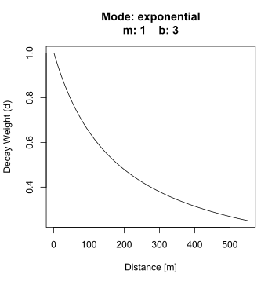

In a previous posts I have [introduced the Viewshed Greenness Visibility Index (VGVI)](https://geobrinkmann.com/post/visible-greenness-exposure/) and demonstrated, [how to fine tune the parameters for calculateing the viewsheds](https://geobrinkmann.com/post/visibility-sensitivity-analysis/). In cooperation with [Dr. S.M. Labib](https://www.smlabib.com/) we have build the R package [GVI](https://github.com/STBrinkmann/GVI), to easily calculating VGVI's. The VGVI expresses the proportion of visible greenness to the total visible area and is calculated using a viewshed based on a Digital Surface Model (DSM). There are other methods to compute visible greenness, for example using Google Street View panorama images instead of a DSM ([Li *et al.* 2015](https://doi.org/10.1016/j.ufug.2015.06.006)). Though the method we present has some advantages, as DSM and Landuse data is already being provided for public use for many regions worldwide. Furthermore, it is very easy to not only compute the overall visible greenness, but - for example - compute visible tree-coverage or visible blue-space. Such information is important to understand how specific build environment features affect health. I will demonstrate how to calculate visible tree-coverage in the end of this post.

On the [GitHub website](https://github.com/STBrinkmann/GVI) we have already provided examples on how to use the functions. However, a use case of this R package for researchers is to compute the VGVI for a large study area.\
Therefore, in this post, I'd like to provide a workflow for a large area of interest, using the City of Vancouver as my study area. GVI uses a fast viewshed implementation that is most efficient for larger areas. In our recent [paper](https://geobrinkmann.com/publication/brinkmann_2022/) we describe this novel algorithm in detail.

## Input

To compute the VGVI we need three raster layers: (1) the Digital Terrain Model (DEM) and (2) Digital Surface Model (DSM) and (3) a Greenspace Mask. The Greenspace Mask is a binary raster based on a Land Cover Classification map, where 1 = vegetation and 0 = no vegetation. I have also included bluespaces (e.g. lakes and rivers) to the greenspace mask with the value 1, since these features also seem to provide mental health benefits ([White *et al.* 2021](https://doi.org/10.1038/s41598-021-87675-0)).

The data can be downloaded from [Zenodo](https://doi.org/10.5281/zenodo.5061256) and read in R like this.

```{r message=FALSE, warning=FALSE, eval=FALSE}
### Load libraries
library(terra) # handling raster data
library(sf)    # handling shapefiles
library(GVI)   # computing the VGVI
library(dplyr) # data wrangeling

# Folder where the data has been downloaded
workdir <- "H:/Vancouver/Vancouver_Sample_Data/"

# Load DTM, DSM and Land Cover
dtm <- rast(file.path(workdir, "Vancouver_DTM_1m.tif"))
dsm <- rast(file.path(workdir, "Vancouver_DSM_1m.tif"))
lulc <- rast(file.path(workdir, "Vancouver_LULC_2m.tif"))

# Reclassify values for the binary greenspace mask

rcl_mat <- matrix(c(1, 6, 0,    # no vegetation
                    6, 13, 1,   # vegetation and water
                    13, 14, 0), # no vegetation
                  ncol = 3, byrow = TRUE)

greenspace <- classify(lulc, rcl = rcl_mat, include.lowest = TRUE)
writeRaster(greenspace, file.path(workdir, "Vancouver_GS_2m.tif"))
```

Below I have provided a interactive map of a smaller region, to compare the DTM, DSM and Landuse. In [my other post](https://geobrinkmann.com/post/visible-greenness-exposure/#section-greenspace-mask) I have also listed all classes of the Landuse map in detail.

<iframe frameborder="0" scrolling="no" seamless="seamless" style="display:block; width:95%; height:85vh;" src="https://h2961284.stratoserver.net/content/leaflets/VGVI%20Input/index.html">

</iframe>

</br>

We also need the observer locations where the VGVI should be computed. In our example we could simply use all coordinates of the whole DSM. However, we can't compute the VGVI from inside buildings, and it wouldn't make sense to compute VGVI on water (unless you are interested in the view of stand-up paddlers). Therefore, in the next step we only use the coordinates of useful cells from the Land Cover Classification map and convert it to a sf-POINT feature.

```{r eval=FALSE}
# Useful Landcover Classification codes
useful_codes <- c(2:11, 13)

# Get XY-coordinates
xy_coords <- xyFromCell(lulc, which(values(lulc) %in% useful_codes)) %>% 
  as_tibble()

# Convert to shapefile
vancouver_2m_sf <- st_as_sf(xy_coords, coords = c("x", "y"), crs = 26910)
```

## VGVI

Before computing the VGVI using the `vgvi_from_sf` function from our GVI R package, I would recommend to think about some important parameters. I have partially covered this in my last [post](https://geobrinkmann.com/post/visibility-sensitivity-analysis/), where I talked about the parameters *raster_res* and *max_distance*. So far, we have not provided recommendations for fitting the weights parameters *m*, *b*, and *mode*, because we need to conduct more research in this area. However, in our study area, m = 1 and b = 3, using the exponential function (see plot below) for calculating the distance decay weights seems sufficient.

{width="351"}

Computing VGVI for a large area using multiple CPU cores can be RAM expensive. In addition to that, loading the complete *Vancouver_2m_xy.gpkg* shapefile into the R session is very RAM expensive, too. GVI is programmed using OpenMP under the hood for parallel C++ computation. This way, the computation is more efficient and faster. On my system computation time for all 16,741,566 points took 2 hours using 22 cores with a RAM usage of \~ 20GB.

```{r eval=FALSE}
# Set your cores here!
cores <- 22

# Calculate VGVI for all 16,741,566 points
vancouver_vgvi <- vgvi_from_sf(observer = vancouver_2m_sf,
                                 dsm_rast = dsm, 
                                 dtm_rast = dtm, 
                                 greenspace_rast = greenspace,
                                 max_distance = 550, observer_height = 1.7,
                                 raster_res = 2,
                                 m = 1, b = 3, mode = "exponential",
                                 cores = cores, 
                                 progress = TRUE)
```

## VGVI to Raster

In most cases we prefer working with raster layers instead of millions of point features. Therefore, we will combine all the VGVI points from the previous step and convert them to a single raster. We will do so using [Inverse Distance Weighting interpolation](https://geobrinkmann.com/post/iwd/). Computation time was \~ 2.5 hours, so total computation time was 3.5 hours using 22 cores.

```{r eval=FALSE}
# We need an AOI shapefile first
aoi <- greenspace >= 0
aoi <- sf::st_as_sf(terra::as.polygons(aoi))

vgvi_idw <- GVI::sf_to_rast(observer = vancouver_vgvi, v = "VGVI",
                            aoi = aoi,
                            max_distance = 400, n = 10,
                            raster_res = 10, beta = 2,
                            cores = 22, progress = TRUE)
```

```{r echo=FALSE, fig.height=6, fig.width=7, message=FALSE, warning=FALSE}
library(terra)
library(mapview)
library(magrittr)

workdir <- "H:/Vancouver/Vancouver_Sample_Data/"

vgvi_idw <- rast(file.path(workdir, "vgvi_idw.tif"))

plot(vgvi_idw)
```

## Tree-Coverage Visibility

As already mentioned in the beginning, it may be of interest to model visible tree-cover or visible blue-spaces or similar visibility assessments. Since we used a Landcover Classification map for differentiating between green vs. no-green, it is now very simple and straight forward to analyze visible tree-cover. As we did before, we need to classify coniferous and deciduous trees as 1, and the rest as 0.

```{r eval=FALSE}
rcl_mat <- matrix(c(1, 6, 0,    # no trees
                    6, 8, 1,    # coniferous and deciduous trees
                    8, 14, 0),  # no trees
                  ncol = 3, byrow = TRUE)

tree_cover <- classify(lulc, rcl = rcl_mat, include.lowest = TRUE)
```

Based on this new binary tree-cover mask, the Viewshed Tree-Cover Visibility Index (VTVI) can be calculated using the scripts from above. I have excluded observer locations that are underneath trees. Below you can see the result of the VGVI and VTVI. As you can see, they have not been computed for areas with buildings or water. In the VGVI layer you can also see, that cells which are located underneath trees have an extremely high VGVI value. This is because the viewshed algorithm can't "see" beyond those trees and returns only one single visible cell, which is green. We are currently working on ways for solving this limitation.

<iframe frameborder="0" scrolling="no" seamless="seamless" style="display:block; width:95%; height:85vh;" src="https://h2961284.stratoserver.net/content/leaflets/VGVI%20Output/index.html">

</iframe>

</br>

When looking at the VTVI layer, higher values are rarely achieved because it is generally harder to view trees compared to overall vegetation. The Langara Golf Course in the south and the Little Mountain park in the north are the two areas with the highest VTVI values. The residential area in the east also achieved relatively high values. This might be explained by the very large London plane trees (*Platanus × acerifolia*), European beech trees (*Fagus sylvatica*) and horse chestnut trees (*Aesculus hippocastanum*) that have been planted in the side alleys.
