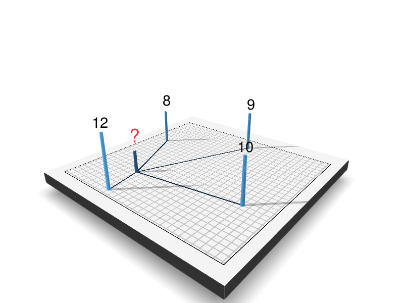

```{r message=FALSE, warning=FALSE, include=FALSE}
library(tidyverse)
library(sf)

theme_Publication <- function(base_size=14, base_family="helvetica") {
  require(grid)
  require(ggthemes)
  require(ggplot2)
  (theme_foundation(base_size=base_size, base_family=base_family)
    + theme(plot.title = element_text(face = "bold",
                                      size = rel(1.2), hjust = 0.5),
            text = element_text(),
            panel.background = element_rect(colour = NA),
            plot.background = element_rect(colour = NA),
            panel.border = element_rect(colour = NA),
            axis.title = element_text(face = "bold",size = rel(1)),
            axis.title.y = element_text(angle=90,vjust =2),
            axis.title.x = element_text(vjust = -0.2),
            axis.text = element_text(), 
            axis.line = element_line(colour="black"),
            axis.ticks = element_line(),
            panel.grid.major = element_line(colour="#f0f0f0"),
            panel.grid.minor = element_blank(),
            legend.key = element_rect(colour = NA),
            legend.position = "bottom",
            legend.direction = "horizontal",
            legend.key.size= unit(0.2, "cm"),
            legend.margin = unit(0, "cm"),
            legend.title = element_text(face="italic"),
            plot.margin=unit(c(10,5,5,5),"mm"),
            strip.background=element_rect(colour="#f0f0f0",fill="#f0f0f0"),
            strip.text = element_text(face="bold")
    ))
}

scale_fill_Publication <- function(...){
  require(scales)
  require(ggplot2)
  discrete_scale("fill","Publication",manual_pal(values = c("#386cb0","#fdb462","#7fc97f","#ef3b2c","#662506","#a6cee3","#fb9a99","#984ea3","#ffff33")), ...)
}

scale_colour_Publication <- function(...){
  library(scales)
  discrete_scale("colour","Publication",manual_pal(values = c("#386cb0","#fdb462","#7fc97f","#ef3b2c","#662506","#a6cee3","#fb9a99","#984ea3","#ffff33")), ...)
  
}
```

A common task in the field of geostatistics is interpolation. According to the first law of Geography, "*Everything is related to everything else. But near things are more related than distant things.*" [@tobler1970]. We can make use of this to interpolate values over a spatial region from a finite set of observations. There are already a number of great sources that describe geospatial interpolation methods [@gisgeography; @berlin; @dunnington; @wilke]. So in this post I don't want to explain these methods again, but instead give a practical example on how to implement Inverse Distance Weighting (IDW) in C++ with Rcpp. I will explain the Rcpp code step by step, the finished result is available in the GVI R package on [GitHub](https://github.com/STBrinkmann/GVI).\
@gisgeography provides an excellent explanation of the maths behind IDW. In short, the interpolated value of any location is based on the values of known locations, assuming closer values are more related than further values.

$$
z = \frac{\sum_{i}^{n}\frac{z_i}{{d_i}^\beta}}{\sum_{i}^{n}\frac{1}{{d_i}^\beta}}
$$

where $z$ is the value to be interpolated, $n$ the number of surrounding known locations, and $z_i$ and $d_i$ their corresponding value and distance, respectively. $\beta$ describes the distance power, that determines the degree to which nearer points are preferred over more distant points.

Below is a small example visualized using the [rayshader](https://www.rayshader.com/) R package:

| Distance | Value |
|----------|-------|
| 300      | 12    |
| 800      | 8     |
| 850      | 10    |
| 1300     | 9     |

```{r eval=FALSE, message=FALSE, warning=FALSE, include=FALSE}
library(rayshader)
e1 <- tibble(
  x = c(8, 2, 20, 11, 27),
  y = c(9, 10, 4, 26, 17),
  v = c(2, 12, 8, 10, 9)
)

n <- nrow(e1) - 1
e1 <- data.frame(y = c(rep(e1$x[1], n), e1$x[-1]),
                 x = c(rep(e1$y[1], n), e1$y[-1]))
e1$grp <- as.factor(rep(1:n, times = 2))
e2 <- e1
e1$v <- c(5, 5, 5, 5, 12, 8, 10, 9)
e2$v <- 0


gg1 <- e1 %>% 
  ggplot(aes(x = x, y = y, group = grp, color = v)) +
  geom_line(data = e2, mapping = aes(x = x, y = y, group = grp),
            lwd = 1) +
  geom_point(size = 2) +
  scale_color_continuous(limits = c(0, 12)) +
  scale_y_continuous(breaks = 1:30, limits = c(2,29), name = NULL) +
  scale_x_continuous(breaks = 1:30, limits = c(2,29), name = NULL) +
  theme_Publication() +
  theme(axis.line = element_blank(),
        axis.text = element_blank(),
        axis.ticks = element_blank(),
        panel.border = element_rect(colour = "black"),
        panel.grid.major = element_line(colour = "gray80"),
        legend.position = "none")

rr1 <- plot_gg(gg1, save_height_matrix = TRUE,
               width = 4, height = 4, scale = 300, multicore = TRUE,
               windowsize = c(800, 600), fov = 70, zoom = 0.65,
               phi = 25, theta = 40, sunangle = 225)
render_label(rr1, text = "?", x = 375, y = 880, z = 130,
             linecolor = NA, textsize = 2.3, textcolor = "#EF3340")
render_label(rr1, text = "12", x = 400, y = 1080, z = 290,
             linecolor = NA, textsize = 1.8)
render_label(rr1, text = "10", x = 990, y = 780, z = 240,
             linecolor = NA, textsize = 1.8)
render_label(rr1, text = "9", x = 650, y = 200, z = 200,
             linecolor = NA, textsize = 1.8)
render_label(rr1, text = "8", x = 200, y = 470, z = 200,
             linecolor = NA, textsize = 1.8)
Sys.sleep(0.5)
render_snapshot("Plots/ray1.png")
rgl::rgl.close()
```

{width="70%"}

Using the equation we can manually calculate the value $z$ for the point in the middle with $\beta = 2$ as:

$z = (\frac{12}{300^2} + \frac{8}{800^2} + \frac{10}{850^2} + \frac{9}{1300^2}) / (\frac{1}{300^2} + \frac{1}{800^2} + \frac{1}{850^2} + \frac{1}{1300^2})\approx 11.3$

# Computing IDW with Rcpp

## Data

First of all we need some data to interpolate. For that we will follow along the example of the FU-Berlin [@berlin] and use weather station data provided by the [Deutscher Wetterdienst (DWD)](http://www.dwd.de/EN/Home/home_node.html) (German Weather Service).

```{r message=FALSE, warning=FALSE}
library(dplyr)
library(sf)

# Retrieve Federal States by the the getData() function from the raster package
east_germany <- c('Sachsen', 'Sachsen-Anhalt', 'Berlin',
                  'Mecklenburg-Vorpommern','Brandenburg', 'Thüringen')

aoi <- raster::getData(country = "Germany", level = 1) %>%
  st_as_sf() %>% 
  filter(NAME_1 %in% east_germany) %>% 
  st_transform(3035) %>%
  st_union()


# Download DWD data
dwd <- read.csv2("https://userpage.fu-berlin.de/soga/300/30100_data_sets/DWD.csv",
                 stringsAsFactors = FALSE) %>% 
  as_tibble() %>% 
  select('LAT','LON', "MEAN.ANNUAL.RAINFALL", "ALTITUDE") %>%
  rename(rain = "MEAN.ANNUAL.RAINFALL") %>% 
  na.omit()

# Convert to SF and transform to ETRS89/LAEA Europe
dwd.sf <- st_as_sf(dwd, coords = c("LON","LAT"), crs = 4326) %>% 
  st_transform(3035) %>% 
  st_intersection(aoi)

```

```{r echo=FALSE, fig.height=5, fig.width=4, message=FALSE, warning=FALSE}
G1 <- raster::getData(country = "Germany", level = 1) 
G1 <- G1[G1$NAME_1 %in% east_germany,]

ggplot() +
    geom_polygon(data = G1,
                 aes(x = long, y = lat, group = group),
                 colour = "grey20", fill = "#fff7bc") +
    geom_point(data = inner_join(dwd, dwd.sf),
               aes(x = LON, y = LAT),
               alpha = .7,
               size = 1) +
    theme_bw() +
    xlab("Longitude") + ylab("Latitude") +
    coord_map()
```

For the Rcpp algorithm, we need to convert the shapefile to a raster first and extract the raster values.

```{r message=FALSE, warning=FALSE}
library(raster)
dwd.rast <- raster(xmn = st_bbox(dwd.sf)[1],
                   xmx = st_bbox(dwd.sf)[3],
                   ymn = st_bbox(dwd.sf)[2],
                   ymx = st_bbox(dwd.sf)[4],
                   crs = st_crs(dwd.sf)$proj4string,
                   resolution = 10000) %>% 
  rasterize(dwd.sf, ., "rain", background = NA)

dwd.rast_values <- getValues(dwd.rast)
```

## Rcpp code

We use the `S4` structure of raster objects to read basic raster information (e.g. resolution, nrow, ...) from the input raster. For that I'll include the RasterInfo structure that you can find [here](https://github.com/STBrinkmann/GVI/blob/main/src/rsinfo.h). The Rcpp implementation of the IDW algorithm has the following general structure:

```{Rcpp eval=FALSE}
#include <Rcpp.h>
#include "rsinfo.h"

using namespace Rcpp;

// [[Rcpp::export]]
NumericVector IDW_Rcpp(S4 &rast, const NumericVector &x,
                       const int n, const double b, const double radius)
{
  // Basic raster information
  RasterInfo rast_info(rast);
  
  // Convert radius to pixel
  const int r_pxl = (int)(radius/rast_info.res);
  
  
  // Output
  NumericVector out(x.size(), NA_REAL);
  
  
  // Main loop: Loop over all values of the raster x
  for(int j = 0; j < x.size(); j++){
    
    // 1. Convert j to row/col and X/Y coordinates
    
    // 2. Calculate distance to all cells and store their values
    
    // 3. Sort by distance and select top n
    
    // 4. Compute IDW
  }
  
  return out;
}
```

Below I will explain all four sections in detail, you can find the final source code on [GitHub](https://github.com/STBrinkmann/GVI/blob/main/src/IDW_cpp.cpp). Also, if you would like to support multithreading, it is really simple using [OpenMP](https://www.openmp.org/). We'll come back to that later.

#### 1. Convert j to row/col and X/Y coordinates

We can use simple math to obtain the row/col and X/Y coordinates from the current cell $j$.

```{Rcpp eval=FALSE}
// row col from cell
const int row_j = j / rast_info.ncol;
const int col_j = j - (row_j * rast_info.ncol);

// XY from cell
const double y_j = rast_info.ymax - (row_j + 0.5) * rast_info.res;
const double x_j = rast_info.xmin + (col_j + 0.5) * rast_info.res;
```

#### 2. Calculate distance to all cells and store their values

To calculate the distance to the current cell $j$ and the corresponding value we need to iterate over all cells that are within the radius. For that we take the row (or column) \$row_j\$ and loop over all rows (or columns) $row_i$, where $row_j-radius <= row_i <= row_j+radius$.

Again, the cell $i$ and X/Y coordinates can be calculated using simple math. The distance from $j$ to $i$ is calculated using simple euclidean distance. Of course one could take the earths curvature into account, but let's keep it simple for now. Finally, the distance and value of cell $i$ will be stored. Note, that the cells $i$ and $j$ can be identical. In this case $d$ would be $0$ and result in a math error due to division by zero. Therefore, we simply store a fraction of the raster resolution in this case. One could also store a very small number or even the true value of $i$. However, while testing different values, this led to very pointy interpolation maps.

```{Rcpp eval=FALSE}
// Distance (d) and value (z) vector
std::vector<double> d;
std::vector<double> z;

// Iterate over all cells that are within the radius
for(int row_i = row_j-r_pxl; row_i <= row_j+r_pxl; row_i++){
  if(row_i > 0 && row_i < rast_info.nrow){
    
    for(int col_i = col_j-r_pxl; col_i <= col_j+r_pxl; col_i++){
      if(col_i > 0 && col_i < rast_info.ncol){
        
        // Cell from row/col
        const int i = row_i * rast_info.ncol + col_i;
        const double i_value = x[i];
        
        if(!NumericVector::is_na(i_value)) {
          // XY from cell
          const double y_i = rast_info.ymax - (row_i + 0.5) * rast_info.res;
          const double x_i = rast_info.xmin + (col_i + 0.5) * rast_info.res;
          
          // Distance
          const double dist = sqrt((x_j-x_i)*(x_j-x_i) + (y_j-y_i)*(y_j-y_i));
          
          // Save distance and value
          if(i == j){
            d.push_back(rast_info.res/4);
            z.push_back(i_value);
          } else if(dist <= radius) {
            d.push_back(dist);
            z.push_back(i_value);
          }
        }
      }
    }
  }
}
```

#### 3. Sort by distance and select top n

To efficiently select only the top $n$ values I have created a little helper function `findBestIndices`. It takes a distance vector `d` and the number of values `N` that should be returned, and returns `N` indices of `d` sorted by distance. So for example if we have a vector `d = c(4,1,6,0)` and `N = 3`, the function returns `c(3, 1, 0)` (C++ starts indexing from 0).

```{Rcpp eval=FALSE}
std::vector<int> findBestIndices(std::vector<double> &d, const int &N)
{   
    std::vector<int> indices(d.size());
    std::iota(indices.begin(), indices.end(), 0); // fill with 0,1,2,...

    std::partial_sort(indices.begin(), indices.begin()+N, indices.end(),
                     [&d](int i,int j) {return d[i]<d[j];});

    return std::vector<int>(indices.begin(), indices.begin()+N);
}
```

Now we can apply this function in our main loop:

```{Rcpp eval=FALSE}
// 3. Sort by distance and select top n
int nn = (d.size() < n) ? d.size() : n;

// Index of n shortest distances
std::vector<int> idx = findBestIndices(d, nn);

// And select value (z) and distance (d) in that order
std::vector<double> z_top_n;
std::vector<double> d_top_n;
for(auto t=idx.begin(); t!=idx.end(); ++t){
  z_top_n.push_back(z[*t]);
  d_top_n.push_back(d[*t]);
}
```

#### 4. Compute IDW

Finally, we have everything to interpolate the value for cell $j$. Again, I've created a small helper function `calc_idw` that applies the equation from the beginning of this post.

```{Rcpp eval=FALSE}
double calc_idw(std::vector<double> &d, std::vector<double> &v, const double b){
    double numerator = 0.0;
    double denominator = 0.0;
    
    // Sum from i to n
    for(std::size_t i = 0; i < d.size(); i++){
        numerator += v[i] / pow(d[i], b);
        denominator += 1 / pow(d[i], b);
    }
    
    return numerator/denominator;
}
```

And include it into the main loop:

```{Rcpp eval=FALSE}
// Compute IDW
out[j] = calc_idw(d_top_n, z_top_n, b);
```

## Comparison with gstat

The `gstat` R package provides a large set of functions useful for geostatistical modelling, prediction and simulation. I followed the instruction provided by the FU Berlin [@berlin] and compared the results and computation time to the Rcpp method. Conveniently they have also conducted a [cross validation](https://www.geo.fu-berlin.de/en/v/soga/Geodata-analysis/geostatistics/Inverse-Distance-Weighting/Model-selection/index.html) to select the parameters $n = 43$ and $\beta = 1.5$ to reduce RMSE.

I have packed all steps for the two approaches into the helper functions `dwd_rcpp` and `dwd_gstat`, you can view them <a href="dwd_helper_funs.R">here</a>.

Let's look at the visual comparison first.

```{r echo=FALSE, message=FALSE, warning=FALSE}
load(url("https://userpage.fu-berlin.de/soga/300/30100_data_sets/East_Germany.RData"))
library(raster)
library(gstat)
Rcpp::sourceCpp("IDW_Rcpp.cpp")

dwd_rcpp <- function(aoi = east.germany.states.sp,
                     data = dwd.east.sp,
                     n = nrow(dwd.east.sp), b = 2,
                     resolution = 10000,
                     ncores = 1, progress = FALSE) {
  dwd.sf <- st_as_sf(aoi)
  data_sf <- st_as_sf(data)
  
  dwd.rast <- raster(xmn = st_bbox(dwd.sf)[1],
                     xmx = st_bbox(dwd.sf)[3],
                     ymn = st_bbox(dwd.sf)[2],
                     ymx = st_bbox(dwd.sf)[4],
                     crs = st_crs(dwd.sf)$proj4string,
                     resolution = resolution) %>% 
    rasterize(data, ., "Rainfall", background = NA)
  
  dwd.rast_values <- getValues(dwd.rast)
  
  idw_vals <- IDW_Rcpp(rast = dwd.rast, x = dwd.rast_values,
                       sf_x = sf::st_coordinates(data_sf)[,1],
                       sf_y = sf::st_coordinates(data_sf)[,2],
                       sf_z = data_sf$Rainfall,
                       n = n, b = b, radius = -1, 
                       display_progress = progress, ncores = ncores)
  dwd.rast[] <- idw_vals
  
  dwd.rast <- dwd.rast %>% 
    crop(aoi) %>%
    mask(aoi)
  
  return(dwd.rast)
}


dwd_gstat <- function(aoi = east.germany.states.sp,
                      data = dwd.east.sp,
                      n = nrow(dwd.east.sp), b = 2,
                      resolution = 10000) {
  if(is(aoi, "sf")){
    aoi <- as(aoi, "Spatial")
  }
  if(is(data, "sf")){
    data <- as(data, "Spatial")
  }
  extent.east.germany <- extent(aoi)
  grid.east.germany <- expand.grid(x = seq(from = round(extent.east.germany@xmin),
                                           to = round(extent.east.germany@xmax),
                                           by = resolution),
                                   y = seq(from = round(extent.east.germany@ymin),
                                           to = round(extent.east.germany@ymax),
                                           by = resolution))
  coordinates(grid.east.germany) <- ~x + y
  proj4string(grid.east.germany) <- proj4string(data)
  gridded(grid.east.germany) <- TRUE
  
  data <- spTransform(data, proj4string(grid.east.germany))
  
  # build model
  idw_rain = gstat(formula = Rainfall ~ 1, # intercept only model
                  data = data, 
                  nmax = n, 
                  set = list(idp = b))
  
  # interpolation
  grid.east.germany.rain <- predict(object = idw_rain,
                                    newdata = grid.east.germany,
                                    debug.level = 0)
  # masking
  grid.east.germany.rain <- mask(raster(grid.east.germany.rain), aoi)
  
  return(grid.east.germany.rain)
}
```

```{r echo=FALSE, message=FALSE, warning=FALSE}
grid.east.germany.rain <- dwd_gstat(aoi = east.germany.states.sp,
                                    data = dwd.east.sp,
                                    b = 1.5, n = 43, resolution = 10000)
dwd.rast <- dwd_rcpp(aoi = east.germany.states.sp,
                     data = dwd.east.sp,
                     b = 1.5, n = 43, resolution = 10000)
```

```{r echo=FALSE, fig.height=6, fig.width=9, message=FALSE, warning=FALSE}
library(gridExtra)

dwd.spdf <- as(dwd.rast, "SpatialPixelsDataFrame")
dwd.df <- as.data.frame(dwd.spdf)
colnames(dwd.df) <- c("z", "x", "y")


grid.east.germany.rain.spdf <- as(grid.east.germany.rain, "SpatialPixelsDataFrame")
grid.east.germany.rain.df <- as.data.frame(grid.east.germany.rain.spdf)
colnames(grid.east.germany.rain.df) <- c("z", "x", "y")


gg_rcpp <- ggplot() +  
  geom_sf(data = st_as_sf(east.germany.states.sp)) +
  geom_tile(data=dwd.df, aes(x=x, y=y, fill=z), alpha=0.8) + 
  geom_sf(data = st_as_sf(dwd.east.sp),
          colour="gray20", shape=21, size = 1.5,
          mapping = aes(fill = Rainfall)) +
  viridis::scale_fill_viridis(limits = c(300, 1900), name = "Rainfall [mm]") +
  coord_sf() +
  ggthemes::theme_map() +
  ggtitle("Rcpp") +
  theme(legend.position="bottom",
        legend.key.width=unit(1, "cm"),
        legend.justification = c(0.5, 0.5),
        legend.text = element_text(size = 9),
        legend.title = element_text(size = 12),
        plot.title = element_text(hjust = 0.5, size = 15))

gg_gstat <- ggplot() +  
  geom_sf(data = st_as_sf(east.germany.states.sp)) +
  geom_tile(data=grid.east.germany.rain.df, aes(x=x, y=y, fill=z), alpha=0.8) + 
  geom_sf(data = st_as_sf(dwd.east.sp),
          colour="gray20", shape=21, size = 1.5,
          mapping = aes(fill = Rainfall)) +
  viridis::scale_fill_viridis(limits = c(300, 1900)) +
  coord_sf() +
  ggtitle("gstat") +
  ggthemes::theme_map() +
  theme(plot.title = element_text(hjust = 0.5, size = 15))

#extract legend
#https://github.com/hadley/ggplot2/wiki/Share-a-legend-between-two-ggplot2-graphs
g_legend<-function(a.gplot){
  tmp <- ggplot_gtable(ggplot_build(a.gplot))
  leg <- which(sapply(tmp$grobs, function(x) x$name) == "guide-box")
  legend <- tmp$grobs[[leg]]
  return(legend)
}

mylegend <- g_legend(gg_rcpp)

gg_combined <- grid.arrange(
  arrangeGrob(gg_rcpp + theme(legend.position="none"),
              gg_gstat + theme(legend.position="none"),
              nrow=1),
  mylegend, nrow=2, heights=c(10, 1)
)
```

On the first glance, both maps look very similar. Apparently the raster generartion using `rasterize` results in a small spatial offset compared to the `gstat` raster. However, the differences are marginal.

Now that we know the algorithm works fine, let's compare computation time.

```{r message=FALSE, warning=FALSE}
load(url("https://userpage.fu-berlin.de/soga/300/30100_data_sets/East_Germany.RData"))

library(microbenchmark)
microbenchmark(
  rcpp = dwd_rcpp(aoi = east.germany.states.sp, data = dwd.east.sp, 
                  n = 43, b = 1.5, resolution = 10000),
  gstat = dwd_gstat(aoi = east.germany.states.sp, data = dwd.east.sp, 
                    n = 43, b = 1.5, resolution = 10000)
)
```

Again, both methods show very similar results. However, when we reduce the resolution (more cells) we clearly see the advantage of using Rcpp.

```{r message=FALSE, warning=FALSE}
microbenchmark(
  rcpp = dwd_rcpp(aoi = east.germany.states.sp, data = dwd.east.sp,
                  n = 43, b = 1.5, resolution = 1000),
  gstat = dwd_gstat(aoi = east.germany.states.sp, data = dwd.east.sp, 
                    n = 43, b = 1.5, resolution = 1000)
)
```

As mentioned previously, supporting multithreading with Rcpp is simple, too. The `dwd_rcpp` function supports multithreading, which enables us to compute rainfall interpolation for whole Germany quickly!

```{r message=FALSE, warning=FALSE}
aoi <- raster::getData(country = "Germany", level = 1) %>%
  st_as_sf() %>% 
  st_transform(3035) %>%
  st_union() %>% 
  st_as_sf()

dwd.sf <- st_as_sf(dwd, coords = c("LON","LAT"), crs = 4326) %>% 
  st_transform(3035) %>% 
  st_intersection(aoi) %>% 
  rename(Rainfall = rain)
```

Rcpp:

```{r message=FALSE, warning=FALSE}
time_start <- Sys.time()
germany_rcpp <- dwd_rcpp(aoi = aoi, data = dwd.sf,
                         resolution = 500, ncores = 24)
round(difftime(Sys.time(), time_start),1)
```

gstat:

```{r message=FALSE, warning=FALSE}
time_start <- Sys.time()
germany_gstat <- dwd_gstat(aoi = aoi, data = dwd.sf,
                           resolution = 500)
round(difftime(Sys.time(), time_start),1)
```

# Conclusion

In this post I've demonstrated how the IDW algorithm can be implemented in C++ using Rcpp. The results match the output of the well established `gstat` R package. Single core computation time is lower using the Rcpp version, especially for more complex tasks (large number of observations; low raster resolution). But where the Rcpp function really stands out is the capability of multithreading. In my research of [Greenspace Visibility](https://geobrinkmann.com/post/visible-greenness-exposure/) I analyse millions of observer locations over a very large area of interest. Using the `gstat` function would take a long time, but utilizing all of my cores reduces computation time significantly. However, `gstat` also supports more complex interpolation methods (e.g. kriging). \
As a next step I will try to include barriers as demonstrated by @gisgeography to simulate the effect of noise barriers or visible obstacles.

I have included the IDW interpolation algorithm in the [GVI](https://github.com/STBrinkmann/GVI) R package that also supports *LINE* and *POLYGON* features as the observer input:

```{r}
library(GVI)
germany_rcpp <- sf_to_rast(observer = dwd.sf, v = "Rainfall", aoi = aoi,
                           beta = 1.5, raster_res = 1000, cores = 22)
```

# References
